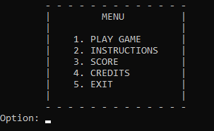
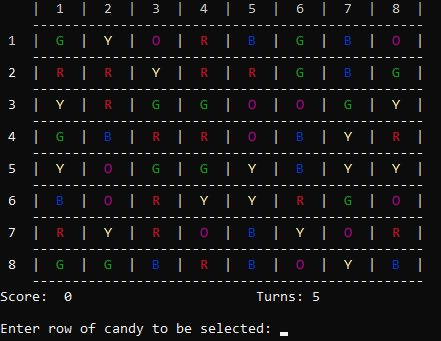
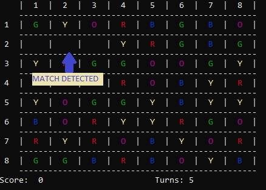
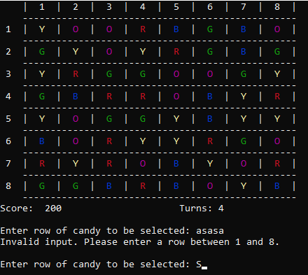

# Candy Crush Game Development

## Project Description

The Candy Crush Game Development project focuses on creating a simplified version of the popular Candy Crush game, emphasizing fundamental game development principles. This project integrates gameplay mechanics, user interface design, and essential algorithms to deliver an engaging gaming experience. The primary goal is to enhance programming skills through practical application, while also exploring potential improvements for future versions.

## Technologies Used

- C++
- Visual Studio Code (G++)
- Standard C++ Libraries: `<iostream>`, `<cstdlib>`, `<ctime>`, `<windows.h>`, `<stdlib.h>`, `<fstream>`, `<string>`

## Setup and Run Instructions

### Prerequisites

- Visual Studio Code installed on your system.
- C++ compiler (G++) installed and properly configured.

### Setup Instructions

1. Clone the project repository or download it as a ZIP archive and extract it to your local machine.
    ```bash
    git clone https://github.com/yourusername/candy-crush-game.git
    ```
2. Launch Visual Studio Code on your computer.
3. Open the project by selecting "Open Folder" from the welcome screen or navigating to `File > Open Folder` and selecting the project directory.
4. Ensure that the necessary extensions and build tools for C++ are installed in Visual Studio Code.

### Running the Project

1. Open the main project file, typically `main.cpp`.
2. Compile and run the project using the build and run commands in Visual Studio Code, or use the integrated terminal:
    ```bash
    g++ -o candy_crush main.cpp
    ./candy_crush
    ```

## Key Features and Functionalities Implemented

1. **Main Menu**:
    - Displays the main menu with options to start the game, view instructions, check past scores, and view credits.
    - Allows user navigation using the Escape key to return to the main menu.

    

2. **Game Board Display**:
    - Visualizes the game board with current score and turns.
    - Uses nested loops to print the board array and update its contents.

    

3. **Gameplay Mechanics**:
    - **Candy Generation**: Randomly generates different types of candies.
    - **Board Initialization**: Populates the board with candies, ensuring no initial matches.
    - **Swap Validation**: Validates candy swaps to ensure only adjacent swaps are allowed.
    - **Match Checking**: Identifies and removes matches of candies, updating the board accordingly.
    - **Cascading Animation**: Animates falling candies to replace matched ones.
    - **Refill Candies**: Refills empty spaces on the board with new candies, ensuring no immediate matches.

    

4. **Error Handling**:
    - Handles incorrect user inputs to prevent crashes.
    - Implements validation and error-checking throughout the game.

    

5. **User Interface**:
    - Features colored candies and an intuitive menu system for easy navigation.
    - Includes animations for cascading effects after matches are made.

    

## Concepts and Utilization

| Concept                | Used In                                                      |
|------------------------|--------------------------------------------------------------|
| Algorithm              | Gameplay mechanics, board initialization, match checking   |
| Control Structures     | Navigating menus, validating swaps, handling game logic    |
| Repetition Structures  | Accessing board elements, looping through game states       |
| Functions              | Implementing gameplay mechanics and UI elements             |
| Arrays, Strings        | Representing the game board, storing user data             |
| Pointers               | Handling empty space locations on the board                |
| File Handling          | Storing and retrieving user scores and game history         |

## Testing and Validation

All incorrect inputs by users have been handled to prevent crashes. The program has been tested by class fellows and group mates using various techniques, including black-box testing, white-box testing, visual testing (printing loop variables), and breakpoints.

## Conclusion

The Candy Crush project successfully implements a simplified version of the game, providing an engaging gaming experience. Valuable lessons were learned in game development, including logic implementation and user interaction.

## Authors

- [Muhammad Wasif Shakeel](https://github.com/mwasifshkeel)
- Hajra Asif

## License

Distributed under the MIT License. See `LICENSE` for more information.

## Acknowledgements

- [C++ Documentation](https://en.cppreference.com/w/)
- [Visual Studio Code](https://code.visualstudio.com/)
- [Standard C++ Libraries](https://en.cppreference.com/w/cpp)
